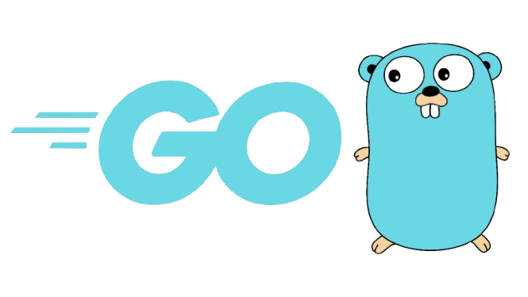

# Hi there 👋

<!--https://user-images.githubusercontent.com/5713670/87202985-820dcb80-c2b6-11ea-9f56-7ec461c497c3.gif-->

Hi guys, I'm **Alireza Keshavarz Najafi**. I am a Python developer from Qazvin, Iran. 
I have some works with **Python**, **Tkinter**, **Turtle** and **Pandas**, contact me if you have the same interests or some questions!

  

# Languages & Tools 👨‍💻 🛠:
 

<!-- For more icons please follow  https://github.com/MikeCodesDotNET/ColoredBadges -->

 
 
 

# Contact Me :

  

If you want to reach out to me about anything, be it some doubt or just to hangout and talk or want to game together just ping me 😉.

<a href="https://www.linkedin.com/in/ashutosh-saxena-7b326817b/">
  
 
 
 
</a>
 

 

 
 
 
 
 
 
 

*************
